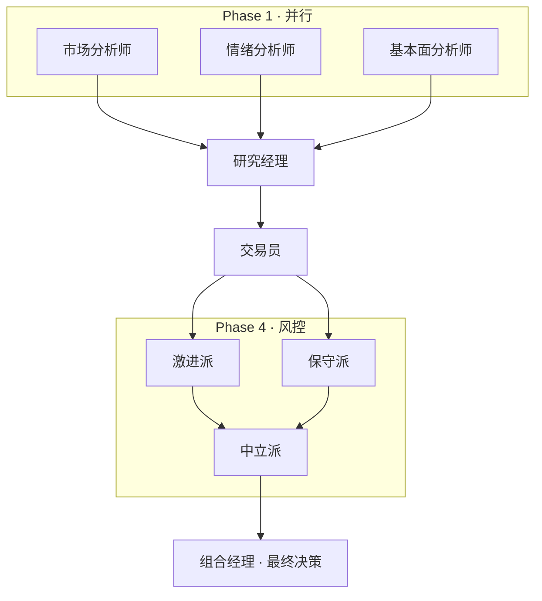

# TradingAgents Web

基于 Vue 3 + Spring Boot + LangChain4j 的 TradingAgents Web 版本，将原 CLI 工具重构为现代化的 Web 应用。

## 技术栈

### 前端
- **Vue 3** + TypeScript + Vite
- **Ant Design Vue 3** - UI 组件库
- **@antv/g6** - 知识图谱可视化
- **Pinia** - 状态管理
- **WebSocket** - 实时通信

### 后端
- **Spring Boot 3.x** + Java 17
- **LangChain4j** - LLM 编排框架
- **WebSocket (STOMP)** - 实时推送
- **WebFlux** - 响应式 HTTP 客户端

## 项目结构

```
tradingagents-web/
├── tradingagents-ui/          # Vue 前端
│   ├── src/
│   │   ├── components/        # 组件
│   │   ├── views/             # 页面
│   │   ├── composables/       # 组合式函数
│   │   ├── styles/            # 样式文件
│   │   └── api/               # API 接口
│   └── package.json
├── tradingagents-server/      # Spring Boot 后端
│   ├── src/main/java/
│   │   └── com/tradingagents/
│   │       ├── controller/    # 控制器
│   │       ├── service/       # 服务层
│   │       ├── agents/        # LangChain4j Agents
│   │       ├── data/          # 数据获取层
│   │       └── model/         # 领域模型
│   └── pom.xml
└── docker/                    # Docker 部署文件
    ├── docker-compose.yml
    ├── Dockerfile-frontend
    ├── Dockerfile-backend
    └── nginx.conf
```

## 功能特性

1. **美观的 UI 设计**
   - 基于 Ant Design Vue 的现代化界面
   - 支持明暗主题切换
   - 响应式布局，适配移动端

2. **知识图谱可视化**
   - Agent 协作流程图
   - 因果推断关系图
   - 决策路径图
   - 数据血缘图

3. **实时分析进度**
   - WebSocket 实时推送
   - 动态流程图展示
   - 实时消息日志

4. **完整的分析流程**
   - 分析师团队（市场/情绪/新闻/基本面）
   - 研究团队（牛熊辩论）
   - 交易员
   - 风控团队（三方辩论）
   - 组合经理

## 分析流程图（GitHub 展示）

仓库根目录与 [docs/analysis-pipeline.md](docs/analysis-pipeline.md) 使用 **Mermaid** 描述流水线；在 GitHub 打开该 Markdown 即可直接看到渲染后的流程图（无需额外服务）。

与当前后端编排一致的总览如下：



更细的步骤说明与前后端时序图见 **[docs/analysis-pipeline.md](docs/analysis-pipeline.md)**。

## 快速开始

### 环境要求
- Node.js 20+
- Java 17+
- Maven 3.9+
- Docker (可选)

### 1. 克隆项目

```bash
git clone <repository-url>
cd tradingagents-web
```

### 2. 配置环境变量

```bash
cp .env.example .env
# 编辑 .env 文件，填入你的 API Keys
```

### 3. 启动后端

```bash
cd tradingagents-server
mvn spring-boot:run
```

后端服务将在 http://localhost:8080 启动

### 4. 启动前端

```bash
cd tradingagents-ui
npm install
npm run dev
```

前端服务将在 http://localhost:5173 启动

### 5. Docker 部署

```bash
# 构建并启动所有服务
docker-compose -f docker/docker-compose.yml up -d

# 查看日志
docker-compose -f docker/docker-compose.yml logs -f

# 停止服务
docker-compose -f docker/docker-compose.yml down
```

## 配置说明

### LLM 配置

在 `tradingagents-server/src/main/resources/application.yml` 中配置：

```yaml
llm:
  provider: openai  # 或 anthropic, google
  openai:
    api-key: ${OPENAI_API_KEY}
    model: gpt-4
```

### 数据源配置

支持 Tushare（A股）、Yahoo Finance、Alpha Vantage：

```yaml
data:
  tushare:
    token: ${TUSHARE_TOKEN}
  alpha-vantage:
    api-key: ${ALPHA_VANTAGE_API_KEY}
```

## 开发计划

- [x] 项目基础架构
- [x] 前端主题系统和组件库
- [x] 知识图谱可视化
- [x] Docker 容器化
- [ ] 数据层 Java 实现
- [ ] LangChain4j Agent 实现
- [ ] WebSocket 实时通信
- [ ] 后端业务逻辑

## 许可证

MIT License
