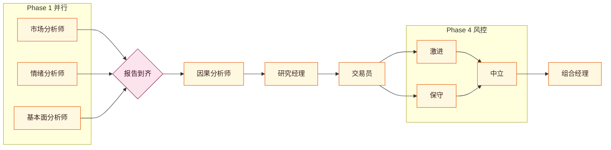

# TradingAgents Web

基于 Vue 3 + Spring Boot + LangChain4j 的 **多智能体股票研究与决策辅助** Web 应用，面向 A 股市场。

## 项目简介

用户输入股票代码或名称后，系统并行运行市场、情绪、基本面分析师，再经**因果链分析**、研究经理、交易员、风控辩论与组合经理协作，产出结构化投资分析与最终决策。前端通过 WebSocket 实时展示进度；后端通过公开数据源抓取行情与新闻，无需额外 token。

> **说明**：分析结论由大语言模型生成，仅供研究与学习参考，不构成投资建议。

## 功能特性

| 能力 | 说明 |
|------|------|
| **多 Agent 流水线** | 9 个 LangChain4j Agent，5 个阶段编排 |
| **因果链分析** | 基于真实新闻构建「事件→因子→指标→结果」图谱，支持向上追因 / 向下看果 |
| **真实数据** | 东财数据中心财务、新浪/东财新闻、新浪 K 线等公开接口 |
| **实时推送** | STOMP WebSocket 推送进度、报告、因果图 |
| **状态持久化** | Docker 部署下 Redis 保存分析记录（默认 7 天） |
| **容器化部署** | Docker Compose + Nginx，含健康检查 |

## 技术栈

### 前端
- Vue 3 + TypeScript + Vite
- Ant Design Vue 4
- Pinia、Vue Router
- @antv/g6（因果链图谱）
- @stomp/stompjs（WebSocket）

### 后端
- Spring Boot 3.2 + Java 17
- LangChain4j + OpenRouter
- WebSocket (STOMP)、WebFlux
- Redis（可选，生产环境持久化）
- Jsoup（新闻抓取）

## 项目结构

```
TradingAgentsWeb/
├── tradingagents-ui/       # Vue 前端
├── tradingagents-server/   # Spring Boot 后端
├── docker/                 # Docker Compose + Nginx
├── docs/
│   ├── analysis-pipeline.md  # 流水线详细文档
│   └── screenshots.md
└── .github/workflows/ci.yml
```

## 分析流水线


```mermaid
flowchart LR
    classDef ag fill:#fff8e1,stroke:#e65100,color:#3e2723
    classDef sys fill:#fce4ec,stroke:#880e4f,color:#3e0d24

    subgraph P1["Phase 1 并行"]
        M1["市场分析师"]:::ag
        M2["情绪分析师"]:::ag
        M3["基本面分析师"]:::ag
    end
    X{"报告到齐"}:::sys
    CA["因果分析师"]:::ag
    RM["研究经理"]:::ag
    TR["交易员"]:::ag
    subgraph P4["Phase 4 风控"]
        R1["激进"]:::ag
        R2["保守"]:::ag
        R3["中立"]:::ag
    end
    PM["组合经理"]:::ag

    M1 & M2 & M3 --> X --> CA --> RM --> TR
    TR --> R1 & R2 --> R3 --> PM
```

完整 Agent 表、时序图与 WS 字段说明见 **[docs/analysis-pipeline.md](docs/analysis-pipeline.md)**。

## 快速开始

### 环境要求
- Node.js 20+
- Java 17+
- Maven 3.9+
- OpenRouter API Key（必需，用于 LLM）
- Docker + Redis（可选，用于生产部署）

### 1. 克隆并配置

```bash
git clone https://github.com/limaonet/TradingAgentsWeb.git
cd TradingAgentsWeb
cp .env.example .env
# 编辑 .env，至少填入 OPENROUTER_API_KEY
```

### 2. 启动后端

```bash
cd tradingagents-server
mvn spring-boot:run
```

后端：http://localhost:8080

### 3. 启动前端

```bash
cd tradingagents-ui
npm install
npm run dev
```

前端：http://localhost:5173

### 4. Docker 部署（含 Redis 持久化）

```bash
# .env 中配置 OPENROUTER_API_KEY
docker compose -f docker/docker-compose.yml up -d --build
docker compose -f docker/docker-compose.yml logs -f
```

访问 http://localhost

## 配置说明

### LLM（OpenRouter）

```bash
OPENROUTER_API_KEY=your_key
DEFAULT_CHAT_MODEL=openai/gpt-4o          # 深度模型（研究经理等）
DEFAULT_QUICK_MODEL=minimax/minimax-m2.5  # 快速模型（分析师等）
```

### 分析状态存储

| 变量 | 默认值 | 说明 |
|------|--------|------|
| `ANALYSIS_STORAGE` | `memory` | 本地开发用内存；Docker prod 自动设为 `redis` |
| `REDIS_HOST` | `localhost` | Redis 地址 |
| `ANALYSIS_STATE_TTL_DAYS` | `7` | 分析记录保留天数 |

### 数据源

当前已接入的**公开数据源**（无需 token）：

- 东方财富数据中心：财务指标、估值、新闻搜索
- 新浪财经：K 线、个股新闻
- 东方财富 / 新浪：实时行情兜底

可选（需自行配置 Cookie）：

```bash
XUEQIU_COOKIE=...   # 雪球舆情增强
GUBA_COOKIE=...     # 股吧舆情增强
```

## 界面说明

- **左侧**：三位分析师（市场 / 情绪 / 基本面）状态卡片
- **中间 Tab**：风控辩论 | **因果链**（可点击节点，向上追因 / 向下看果）
- **右侧**：组合经理最终决策
- **底部**：分析流水线进度条

支持深链接恢复分析：

```
http://localhost:5173/?analysisId=<uuid>
```

> Docker 部署下分析记录存于 Redis（7 天）；本地 memory 模式重启后丢失。

## 开发

```bash
# 后端测试
cd tradingagents-server
mvn test -Dtest=CausalGraphParserTest,InMemoryAnalysisStateStoreTest,EastMoneyDataCenterClientTest

# 前端检查
cd tradingagents-ui
npm run type-check && npm run lint && npm run build
```

CI 在每次 push / PR 时自动运行（见 `.github/workflows/ci.yml`）。

## 开发进度

- [x] 项目基础架构
- [x] LangChain4j 多 Agent 流水线
- [x] WebSocket 实时推送
- [x] 数据层（东财 / 新浪公开 API）
- [x] 因果链分析与可视化
- [x] Redis 分析状态持久化
- [x] Docker 部署与健康检查
- [x] GitHub Actions CI
- [ ] 营收增长率同比计算优化
- [ ] 用户鉴权与限流

## 许可证

[MIT License](LICENSE)
