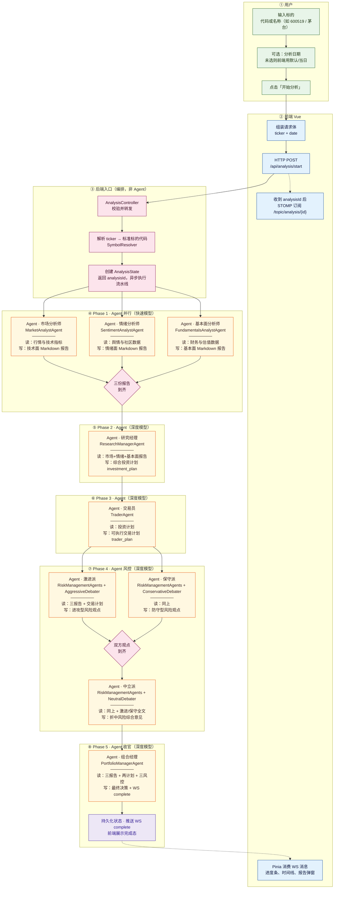
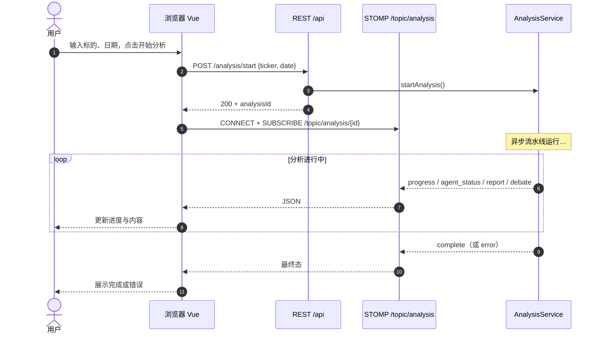

# 分析流水线（从用户输入到最终决策）

本文档与 `tradingagents-server` 中 `AnalysisService#executeAnalysisFlow` 的**实际执行顺序**一致。GitHub 会渲染文中的 Mermaid 图。

## Agent 一览（谁负责什么）

下表为流水线中的 **LangChain4j Agent**：Spring `@Component` 类名、所用模型档位、**读入什么**、**产出什么**、以及推送到前端的 WS 角色名（与 `analysisStore` 对齐）。编排层 `AnalysisService` 本身不是 Agent。

| # | 展示名 | Java 类 | 模型 | 主要输入 | 主要输出 | WS / 报告类型 |
|---|--------|---------|------|----------|----------|----------------|
| 1 | 市场分析师 | `MarketAnalystAgent` | 快速模型 `quickThinkingModel` | 标的、日期；`StockDataService` 拉行情与技术指标 | 技术分析报告（Markdown） | `market_analyst` → `market_report` |
| 2 | 情绪分析师 | `SentimentAnalystAgent` | 快速模型 | 标的、日期；`SentimentDataService` 拉舆情/社区等 | 情绪与舆情分析报告 | `sentiment_analyst` → `sentiment_report` |
| 3 | 基本面分析师 | `FundamentalsAnalystAgent` | 快速模型 | 标的、日期；财务与基本面数据 | 基本面分析报告 | `fundamentals_analyst` → `fundamentals_report` |
| 4 | 研究经理 | `ResearchManagerAgent` | 深度模型 `deepThinkingModel` | 上述三份报告（当前编排里「新闻」参数传 `null`，由情绪报告覆盖舆情） | **投资计划** `investment_plan` | `research_manager` |
| 5 | 交易员 | `TraderAgent` | 深度模型 | 投资计划全文 | **交易计划** `trader_plan`（可执行层面的方案） | `trader` |
| 6a | 激进派风控 | `RiskManagementAgents#aggressiveAnalysis` | 深度模型；内部 `AggressiveDebater` | 市场/情绪/基本面报告 + 交易计划 | 激进立场风险论述 | `debate` · speaker `aggressive` |
| 6b | 保守派风控 | `RiskManagementAgents#conservativeAnalysis` | 深度模型；`ConservativeDebater` | 同上 | 保守立场风险论述 | `debate` · speaker `conservative` |
| 6c | 中立派风控 | `RiskManagementAgents#neutralAnalysis` | 深度模型；`NeutralDebater` | 同上 + **激进 + 保守** 两段文字 | 折中后的风险综合意见 | `debate` · speaker `neutral` |
| 7 | 组合经理 | `PortfolioManagerAgent` | 深度模型；`PortfolioManager` 接口 | 三份分析师报告 + 投资计划 + 交易计划 + **三份风控观点** | **最终交易决策**（并触发 `sendComplete`） | `portfolio_manager` · `complete` |

**并行关系**：表 1–3 同时跑；表 6a 与 6b 同时跑，二者结束后才跑 6c。

---

## 阶段说明（谁在做什么）

| 阶段 | 角色 | 职责 |
|------|------|------|
| 用户 & 前端 | 用户 | 输入股票代码/名称，可选日期，点击「开始分析」。 |
| 用户 & 前端 | Vue 前端 | 调用 `POST /api/analysis/start`；用返回的 `analysisId` 建立 STOMP 订阅，实时更新进度与报告。 |
| 入口 | `AnalysisController` / `AnalysisService` | 接收请求、解析 ticker 为统一标的代码、创建任务、异步启动流水线。 |
| Phase 1 | 市场 / 情绪 / 基本面分析师（**并行**） | 分别产出技术面、舆情情绪、财务与估值维度的分析报告。 |
| Phase 2 | 研究经理 | 综合三份报告，形成**投资计划**（策略与逻辑）。 |
| Phase 3 | 交易员 | 在投资计划基础上细化**交易计划**（价位、仓位、止盈止损等可执行要素）。 |
| Phase 4 | 激进派 & 保守派风控（**并行**）→ 中立派 | 从风险收益不同立场评估交易计划；中立派在双方结论之上做**折中与综合**。 |
| Phase 5 | 组合经理 | 汇总全部材料，输出**最终交易决策**（可对外展示的综合结论）。 |
| 结束 | 状态 + WebSocket | 任务标记完成，向前端推送 `complete`；界面展示最终结果。 |

---

## 全链路流程图（从用户输入开始）

下图从左到右、从上到下阅读：**实线**为主干数据流；Phase 1 与 Phase 4 中并列的框为**并行**执行，汇入菱形汇合点后再进入下一步。

说明：

- **虚线** `-.->`：`analysisId` 一旦可用即可建立 WebSocket；分析过程中消息持续推送到 `F4`。
- **并行**：`A1/A2/A3` 与 `V1/V2` 在代码中分别为 `Mono.zipDelayError` / `Mono.zip` 语义。

---

## 前后端时序（补充）

## 相关代码

- 编排：`tradingagents-server/src/main/java/com/tradingagents/service/AnalysisService.java`
- 推送：`tradingagents-server/src/main/java/com/tradingagents/websocket/AnalysisProgressHandler.java`
- 前端：`tradingagents-ui/src/stores/analysisStore.ts`、`tradingagents-ui/src/composables/useWebSocket.ts`
