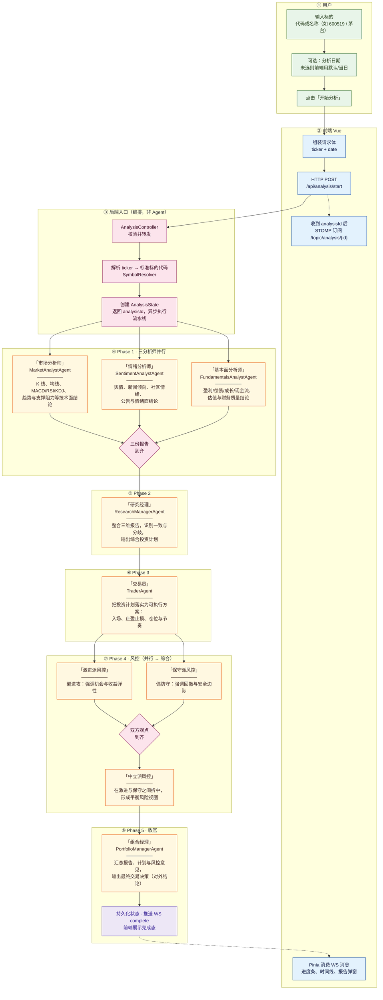
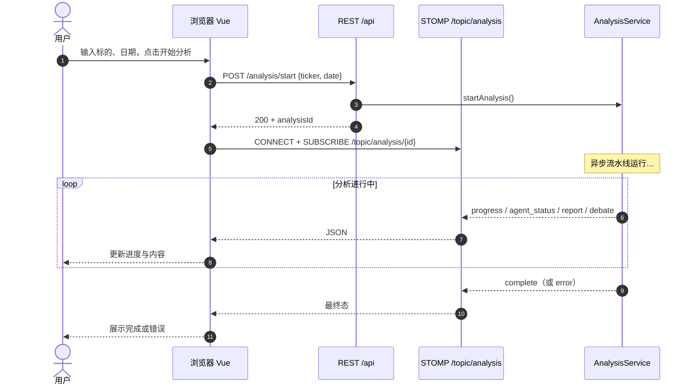

# 分析流水线（从用户输入到最终决策）

本文档与 `tradingagents-server` 中 `AnalysisService#executeAnalysisFlow` 的**实际执行顺序**一致。GitHub 会渲染文中的 Mermaid 图。

## 阶段说明（谁在做什么）

| 阶段 | 角色 | 职责 |
|------|------|------|
| 用户 & 前端 | 用户 | 输入股票代码/名称，可选日期，点击「开始分析」。 |
| 用户 & 前端 | Vue 前端 | 调用 `POST /api/analysis/start`；用返回的 `analysisId` 建立 STOMP 订阅，实时更新进度与报告。 |
| 入口 | `AnalysisController` / `AnalysisService` | 接收请求、解析 ticker 为统一标的代码、创建任务、异步启动流水线。 |
| Phase 1 | 市场 / 情绪 / 基本面分析师（**并行**） | 分别产出技术面、舆情情绪、财务与估值维度的分析报告。 |
| Phase 2 | 研究经理 | 综合三份报告，形成**投资计划**（策略与逻辑）。 |
| Phase 3 | 交易员 | 在投资计划基础上细化**交易计划**（价位、仓位、止盈止损等可执行要素）。 |
| Phase 4 | 激进派 & 保守派风控（**并行**）→ 中立派 | 从风险收益不同立场评估交易计划；中立派在双方结论之上做**折中与综合**。 |
| Phase 5 | 组合经理 | 汇总全部材料，输出**最终交易决策**（可对外展示的综合结论）。 |
| 结束 | 状态 + WebSocket | 任务标记完成，向前端推送 `complete`；界面展示最终结果。 |

---

## 全链路流程图（从用户输入开始）

下图从左到右、从上到下阅读：**实线**为主干数据流；Phase 1 与 Phase 4 中并列的框为**并行**执行，汇入菱形汇合点后再进入下一步。

说明：

- **虚线** `-.->`：`analysisId` 一旦可用即可建立 WebSocket；分析过程中消息持续推送到 `F4`。
- **并行**：`A1/A2/A3` 与 `V1/V2` 在代码中分别为 `Mono.zipDelayError` / `Mono.zip` 语义。

---

## 前后端时序（补充）

## 相关代码

- 编排：`tradingagents-server/src/main/java/com/tradingagents/service/AnalysisService.java`
- 推送：`tradingagents-server/src/main/java/com/tradingagents/websocket/AnalysisProgressHandler.java`
- 前端：`tradingagents-ui/src/stores/analysisStore.ts`、`tradingagents-ui/src/composables/useWebSocket.ts`
