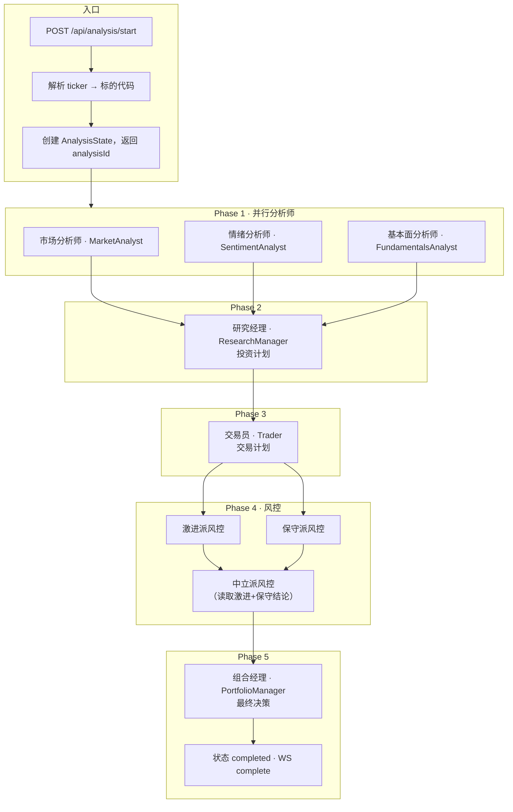
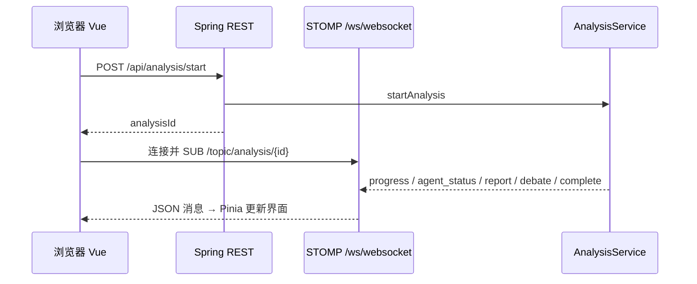

# 分析流水线（后端编排）

本文档描述一次股票分析从 API 进入到最终决策的**实际执行顺序**，与 `tradingagents-server` 中 `AnalysisService#executeAnalysisFlow` 一致。GitHub 会自动渲染文中的 Mermaid 图。

## 总览

1. **Phase 1**：市场、情绪、基本面三位分析师**并行**执行（`Mono.zipDelayError`）。
2. **Phase 2**：研究经理综合三份报告，生成投资计划。
3. **Phase 3**：交易员基于投资计划生成交易计划。
4. **Phase 4**：风控 — 激进派与保守派**并行**，再由中立派综合两方观点。
5. **Phase 5**：组合经理生成最终交易决策；完成后通过 WebSocket 推送 `complete`。

进度与中间结果由 `AnalysisProgressHandler` 推送到 STOMP 主题 `/topic/analysis/{analysisId}`。

## 编排流程图

## 客户端与实时推送（简图）

## 相关代码

- 编排：`tradingagents-server/src/main/java/com/tradingagents/service/AnalysisService.java`
- 推送：`tradingagents-server/src/main/java/com/tradingagents/websocket/AnalysisProgressHandler.java`
- 前端消费：`tradingagents-ui/src/stores/analysisStore.ts`、`tradingagents-ui/src/composables/useWebSocket.ts`
