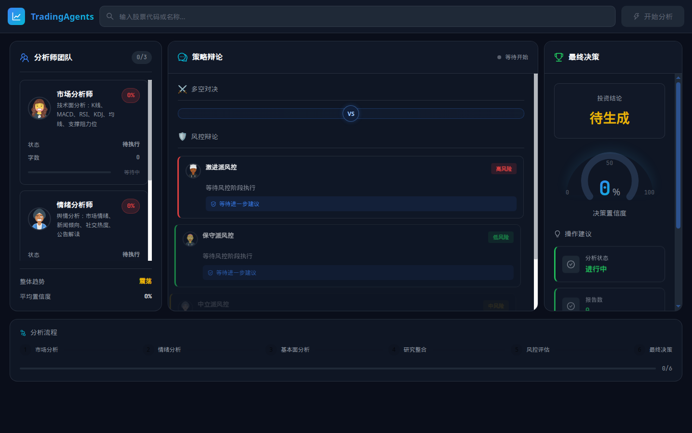
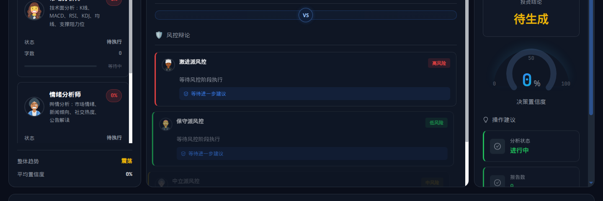
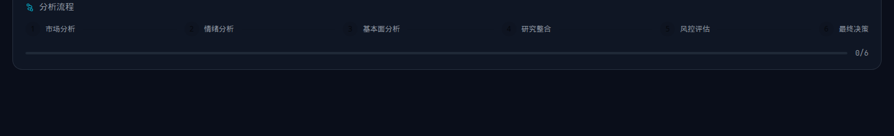

# 界面截图

以下为在开发环境（深色主题仪表盘）下截取的画面，便于在 GitHub 上快速了解布局。完整交互需本地启动前后端，参见根目录 [README.md](../README.md)。

## 仪表盘

| 说明 | 预览 |
|------|------|
| 整页（顶栏 + 三栏 + 底部流程） |  |
| 主内容区（分析师 / 辩论 / 决策） |  |
| 底部分析流程条 |  |

## 深链已有分析（可选）

启动前后端后，可将某次任务的 `analysisId` 写在 URL 查询参数中，页面会写入 `localStorage` 并尝试从后端恢复该次分析状态（适合演示与截图，无需再次点击「开始分析」）：

`http://localhost:5173/?analysisId=<你的 analysisId>`
